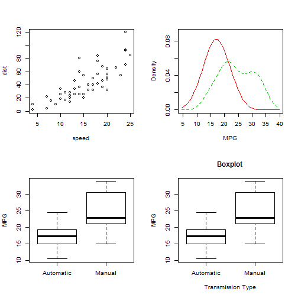
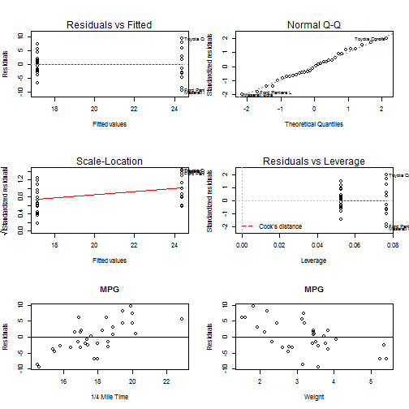

Example of ANOVA Analysis
========================================================
author: Alvaro
date: August, 2014

Looking at a data set of a collection of cars, we explore the relationship between a set of variables and miles per gallon (MPG) answering the following question: Is an automatic or manual transmission better for MPG


Getting Data
========================================================


```r
summary(cars)
```

```
     speed           dist    
 Min.   : 4.0   Min.   :  2  
 1st Qu.:12.0   1st Qu.: 26  
 Median :15.0   Median : 36  
 Mean   :15.4   Mean   : 43  
 3rd Qu.:19.0   3rd Qu.: 56  
 Max.   :25.0   Max.   :120  
```

```r
aggregate(mpg ~ am, data = mtcars, mean)
```

```
         am   mpg
1 Automatic 17.15
2    Manual 24.39
```

Exloratory Data Analysis
========================================================

 

Modelling
========================================================

- Initial Model

```r
inimodel <- lm(mpg ~ am, data = mtcars)
```

- Best Model

```r
bestmodel <- lm(mpg ~ am, data = mtcars)
```

- Base Model

```r
basemodel <- lm(mpg ~ am, data = mtcars);
```

Results
========================================================
ANOVA analysis

```r
MODEL <- bestmodel
anova(inimodel, MODEL)
```

```
Analysis of Variance Table

Model 1: mpg ~ am
Model 2: mpg ~ am
  Res.Df RSS Df Sum of Sq F Pr(>F)
1     30 721                      
2     30 721  0         0         
```

Influential and high leverage outlying points.

```r
InfP <- dfbetas(MODEL);   tail(sort(InfP[, "amManual"]), 3)
```

```
  Lotus Europa       Fiat 128 Toyota Corolla 
        0.2869         0.3912         0.4749 
```

```r
LevP <- hatvalues(MODEL); tail(sort(LevP), 3)
```

```
   Volvo 142E Mazda RX4 Wag     Mazda RX4 
      0.07692       0.07692       0.07692 
```

***

 

